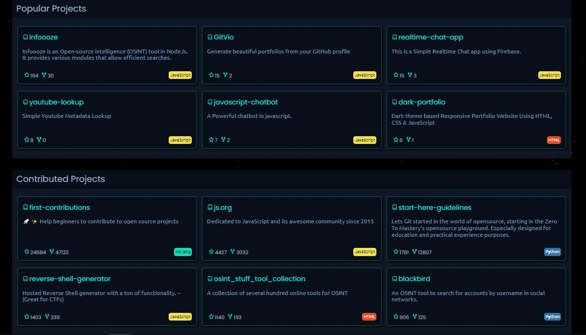

<div id="top"></div>

<p align="center">
  <a href="https://github.com/devXprite/GitVio">
    
  </a>
</p>

<h1 align="center">Create beautiful portfolio from your GitHub profile⚡️</h1>

<br>
    
<p align="center">
    <a href="https://github.com/devXprite/GitVio/blob/master/LICENSE"></a>
    
    <a href="https://github.com/devXprite/GitVio/network"></a>
    <a href="https://github.com/devXprite/GitVio/stargazers"></a>
    <br/>
    <a href="https://gitvio.vercel.app/">View Demo</a>
    ·
    <a href="https://github.com/devXprite/GitVio/issues/new?assignees=&labels=bug&template=bug_report.md&title=">Report Bug</a>
    ·
    <a href="https://github.com/devXprite/gitvio/issues">Request Feature</a>
</p>
<br />

Gets your Github profile under a single page in a resume type format

## Usage 

Simply go to https://gitvio.vercel.app and type Github username there.
<p align="center">OR</p>
Directly go to https://gitvio.vercel.app/@YOUR_USERNAME


## Features 🚀

The resume generated by Getvio contains the following :-
- All your Github stats.
- All languages used (with percentage).
- All your popular projects.
- All the projects you have contributed to.
- The contribution calender.

[](https://gitvio.vercel.app/)
[](https://gitvio.vercel.app/)
<!-- [](https://gitvio.vercel.app/) -->

## Getting Started

To run the website locally follow these simple steps.

### Prerequisites

* NodeJs
* npm

### Installation

1. Get your Github Personal Access Token.
2. Clone the repo
   ```sh
   git clone https://github.com/devXprite/gitvio.git
   ```
3. Install NPM packages
   ```sh
   npm install
   ```
4. Enter your TOKEN in `.env`
   ```env
   TOKEN=GITHUB_TOKEN
   ```
5. Starting server
   ```bash
   npm start
   ```
>  Server should now be running on localhost

<!-- ROADMAP -->
## Roadmap

- [ ] Github Timeline
- [ ] Github competition between two users
- [x] Contribution Calendar


<!-- CONTRIBUTING -->
## Contributing

If you have a suggestion that would make this better, please fork the repo and create a pull request. You can also simply open an issue with the tag "enhancement".
Don't forget to give the project a Star ⭐! Thanks again!

1. Fork the Project
2. Create your New Branch 
3. Commit your Changes 
4. Push to the Branch 
5. Open a Pull Request


## Contributors ✨

Thanks goes to these wonderful people

 


<!-- LICENSE -->
 ## License

Distributed under the MIT License. See `LICENSE.txt` for more information.

<p align="right">(<a href="#top">back to top</a>)</p>

